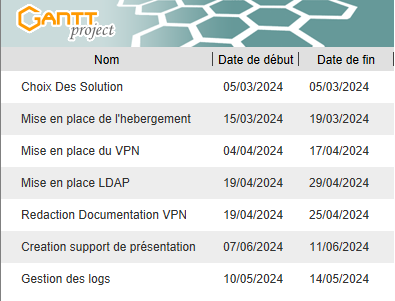
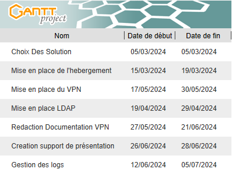
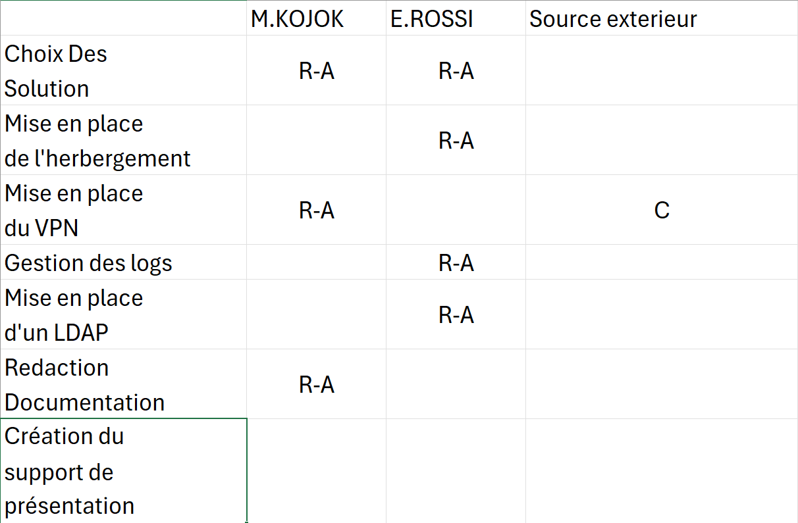

# Gestion du Projet VPN

## Introduction
Voici la gestion de projet de notre groupe composé de `KOJOK TARRAF Malcom` et `ROSSI Enzo`.

## PLANNING PRÉVISIONEL


Voici plus en détails ce qui était prévu de base.



Malheuresement la majorité des dates de ce planning n'ont pas pu être respecté dû a beaucoup de choses notemment à des problèmes personnels et aussi et surtout à d'autre gros projets à rendre plus tôt.

Voici donc le planning le plus proche que l'on ai suivi :




## RACI



Comme vous pouvez le voir, les tâches on été répartie de manière éfficace et logique a notre sens selon ce que chacun se sentait a l'aise de réaliser.

## MATRICE DE CHOIX

### COMMUNICATION

- Discord


Nous avons décider d'utiliser le logiciel discord pour nos différents échanges. Étant facile d'utilisation notament dans l'échange de fichier, il convenait largement à tout nos besoins.

- Gantt Project


Gantt Project à été choisi pour notre organisation. Sa simplicité de prévision nous a grandement plut.

### PROJET


- AWS


Pourquoi AWS? Pourquoi pas une VM normale en locale ? Tant de questions auquelles je repondrai simplement "Travail d'équipe". Il s'agit d'une VM normale qui tourne sous Debian mais héberger sur les serveurs AWS ce qui nous permets de travailler sans avoir à attendre de se voir pour travailler chacun son tour sur une VM locale, ou dans un autre cas de faire deux VM 


- OpenVPN


OpenVPN est un logiciel gratuit et open-source qui permet de créer un réseau privé virtuel (VPN) pour sécuriser les connexions Internet. Dans ce projet, celui-ci doit nous permettre de nous connecter de façon sécurisé à un intranet héberger sur un serveur web. Pourquoi OpenVPN, parce que c'est celui qui nous parlait le plus, et qui à une doc le plus accèssible, enormément de cas d'usages disponible sur en écrit ou en vidéo.


# Documentation Technique du Projet VPN

## Introduction
Ce guide fournit des instructions détaillées pour la configuration d'un VPN (Virtual Private Network) utilisant OpenVPN, installer sur une VM (Virtual Machine) stocker sur un serveur AWS. Dans ce guide est aussi compris la création de certificats, la gestion des utilisateurs et la configuration du serveur et des clients.

## Configuration du Serveur VPN

### Étape 1 : Installation d'OpenVPN

#### 1.1 Mise à jour du système
```bash
sudo apt update
sudo apt upgrade -y
```

#### 1.2 Installation d'OpenVPN et Easy-RSA
```bash
sudo apt install openvpn easy-rsa -y
```

### Étape 2 : Configuration d'Easy-RSA

#### 2.1 Préparation du répertoire Easy-RSA
```bash
mkdir -p ~/easy-rsa
cd ~/easy-rsa
cp -r /usr/share/easy-rsa/* .
```

#### 2.2 Initialisation du PKI
```bash
./easyrsa init-pki
```

#### 2.3 Construction de l'Autorité de Certification (CA)
```bash
./easyrsa build-ca
```
Répondez aux invites pour définir un mot de passe et les informations de certificat.

#### 2.4 Génération du certificat et de la clé du serveur
```bash
./easyrsa build-server-full server nopass
```

#### 2.5 Génération des paramètres Diffie-Hellman
```bash
./easyrsa gen-dh
```

#### 2.6 Génération des certificats des clients
```bash
./easyrsa build-client-full client1 nopass
```

#### 2.7 Copie des fichiers nécessaires
```bash
sudo cp pki/ca.crt /etc/openvpn/
sudo cp pki/private/server.key /etc/openvpn/
sudo cp pki/issued/server.crt /etc/openvpn/
sudo cp pki/dh.pem /etc/openvpn/
sudo cp pki/issued/client1.crt /etc/openvpn/
sudo cp pki/private/client1.key /etc/openvpn/
```

### Étape 3 : Configuration du serveur OpenVPN

#### 3.1 Création manuelle du fichier de configuration du serveur
1. Créer le fichier de configuration du serveur :
```bash
sudo nano /etc/openvpn/server.conf
```
2. Ajouter les lignes de configuration nécessaires :
```text
Copiez et collez le contenu suivant dans le fichier server.conf :

port 1194
proto udp
dev tun
ca ca.crt
cert server.crt
key server.key
dh dh.pem
server 10.8.0.0 255.255.255.0
ifconfig-pool-persist ipp.txt
push "redirect-gateway def1 bypass-dhcp"
push "dhcp-option DNS 8.8.8.8"
push "dhcp-option DNS 8.8.4.4"
keepalive 10 120
tls-auth ta.key 0 # This file is secret
cipher AES-256-CBC
user nobody
group nogroup
persist-key
persist-tun
status openvpn-status.log
verb 3
plugin /usr/lib/openvpn/openvpn-auth-ldap.so /etc/openvpn/auth/ldap.conf
client-cert-not-required
username-as-common-name
```

#### 3.2 Générer la clé TLS-Auth (ta.key)
```bash
sudo openvpn --genkey secret /etc/openvpn/ta.key
```

### Étape 4 : Configuration LDAP

#### 4.1 Installation du serveur LDAP (OpenLDAP)
Installer OpenLDAP :
```bash
sudo apt install slapd ldap-utils -y
sudo dpkg-reconfigure slapd
```
Suivez les instructions pour configurer le domaine et l'administrateur LDAP.

#### 4.2 Installation du module LDAP pour OpenVPN
Installer le module LDAP :
```bash
sudo apt install libpam-ldapd -y
```

#### 4.3 Configuration du module LDAP
Configurer le module LDAP :
```bash
sudo nano /etc/nslcd.conf
```
Modifiez les paramètres pour qu'ils correspondent à votre serveur LDAP :
```text
uri ldap://your-ldap-server
base dc=example,dc=com
binddn cn=admin,dc=example,dc=com
bindpw your_admin_password
```

### Étape 5 : Configuration du plugin LDAP pour OpenVPN

#### 5.1 Création du répertoire de configuration LDAP pour OpenVPN
1. Créer le répertoire et le fichier de configuration LDAP :
```bash
sudo mkdir -p /etc/openvpn/auth
sudo nano /etc/openvpn/auth/ldap.conf
```
2. Ajouter la configuration LDAP :
```text
Exemple de fichier ldap.conf :

<LDAP>
  URL             ldap://your-ldap-server
  BindDN          cn=admin,dc=example,dc=com
  Password        your_admin_password
  Timeout         15
  TLSEnable       no
  FollowReferrals yes
  DerefAliases    yes

  # LDAP Search
  BaseDN          "ou=users,dc=example,dc=com"
  SearchFilter    "(&(uid=%u)(objectClass=posixAccount))"
  RequireGroup    false
  <Group>
    BaseDN        "ou=groups,dc=example,dc=com"
    SearchFilter  "(&(objectClass=posixGroup)(memberUid=%u))"
    MemberAttribute  memberUid
  </Group>
</LDAP>
```

### Étape 6 : Configuration du Pare-feu (Firewall)
Configurer ufw pour permettre le trafic VPN :
```bash
sudo ufw allow 1194/udp
sudo ufw allow OpenSSH
sudo ufw enable
```

### Étape 7 : Redémarrage du service OpenVPN
Redémarrer le service OpenVPN : (il se peut que vous ayez une erreur lors du restart du service, normalement l'installation du package suivant devrait la résoudre donc faites la avant le restart)
```bash
sudo apt-get install openvpn-auth-ldap
sudo systemctl restart openvpn@server
```

## Configuration du Client OpenVPN

### 8.1 Création du fichier de configuration client
Exemple de fichier client1.ovpn :
```text
client
dev tun
proto udp
remote your-server-ip 1194
resolv-retry infinite
nobind
user nobody
group nogroup
persist-key
persist-tun
ca ca.crt
cert client1.crt
key client1.key
remote-cert-tls server
auth-user-pass
tls-auth ta.key 1
cipher AES-256-CBC
verb 3
```

### 8.2 Placement du fichier de configuration client
- Sur Windows : Copiez client1.ovpn, ca.crt, client1.crt, client1.key, et ta.key dans C:\Program Files\OpenVPN\config.

- Sur macOS : Double-cliquez sur client1.ovpn pour l'importer dans Tunnelblick.

- Sur Linux : Copiez client1.ovpn, ca.crt, client1.crt, client1.key, et ta.key dans ~/openvpn ou /etc/openvpn/client


### Étape 9 : Documentation pour l'Utilisateur Final


## Guide de connexion au VPN (OpenVPN)

### 1. Introduction
Le VPN (Virtual Private Network) permet aux employés de se connecter au réseau de l'entreprise de manière sécurisée, même à distance. Voici comment configurer votre connexion VPN.

### 2. Prérequis
- **Matériel** : Un ordinateur avec OpenVPN installé.
- **Informations** : Vous aurez besoin des informations suivantes :
  - Adresse IP du serveur VPN
  - Nom d'utilisateur et mot de passe
  - Certificats et clés (fournis par l'administrateur réseau)

### 3. Installation d'OpenVPN
1. Téléchargez et installez [OpenVPN](https://openvpn.net/community-downloads/) sur votre ordinateur.
2. Suivez les instructions d'installation.

### 4. Configuration du client
1. Ouvrez le gestionnaire de connexions OpenVPN.
2. Importez le fichier de configuration fourni par l'administrateur (par exemple, `entreprise.ovpn`).
3. Saisissez votre nom d'utilisateur et mot de passe.

### 5. Connexion au VPN
1. Lancez OpenVPN et sélectionnez le profil de l'entreprise.
2. Cliquez sur "Connecter".
3. Vous êtes maintenant connecté au réseau de l'entreprise !

### 6. Déconnexion
N'oubliez pas de vous déconnecter lorsque vous avez terminé :
- Cliquez sur "Déconnecter" dans OpenVPN.


## Commande Importantes :

``` cat /etc/hosts ``` pour obtenir votre URI.

``` curl ifconfig.me ``` pour obtenir l'ip publique de votre machine.